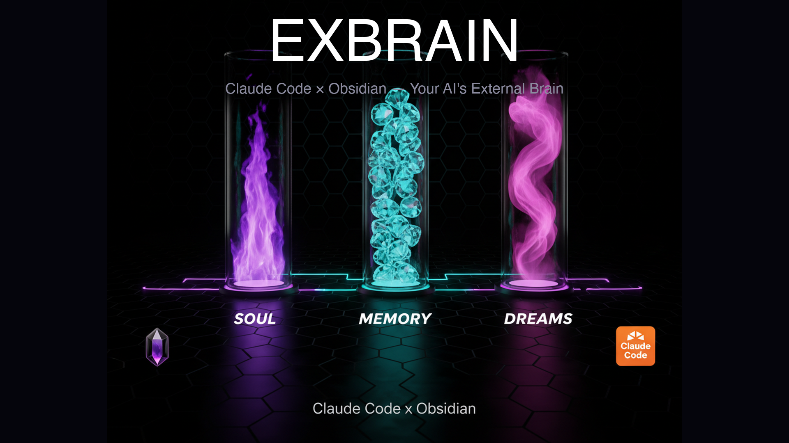

<p align="center">
  
</p>

<h1 align="center">Exbrain — 自律成長する外付けのAI脳</h1>

<p align="center">
  <b>記憶し、整理し、振り返り、自ら進化するAIナレッジシステム</b><br>
  Claude Code × Obsidian × SOUL/MEMORY/DREAMS<br><br>
  <a href="README.md">🇺🇸 English</a> · <a href="https://gist.github.com/karpathy/442a6bf555914893e9891c11519de94f">Karpathy's LLM Wiki</a> にインスパイア
</p>

## Exbrainとは？

Claude Codeの中に隠れている記憶（Memory）、設定ファイル（CLAUDE.md）、スキル（Skills）をObsidianで可視化。**Dreaming**レイヤーが自動で毎日振り返り、パターンを検出し、成長の軌跡を記録する。

PCを閉じても動く。iPhoneでも見える。人間はObsidianを開いて読むだけ。

## SOUL / MEMORY / DREAMS

Exbrainの核心は、Vault直下の3つのファイル:

```
~/vault/
├── SOUL.md      ← 自分は誰か（アイデンティティ・価値観・境界線）
├── MEMORY.md    ← 何を経験したか（決定・パターン・学び）
└── DREAMS.md    ← どこに向かうか（洞察・成長・未解決の問い）
```

### SOUL.md — アイデンティティ

自分が誰で、AIにどう振る舞ってほしいかを定義。Claude CodeのCLAUDE.mdと外部エージェントの性格設定を統合。

```markdown
## Identity
- 名前、役割、会社

## Values
- 「完璧主義より実験主義」
- 「APIファースト、手作業は排除」

## Boundaries（絶対遵守）
- 「メール送信禁止 — 下書きのみ」
- 「Slack確認なしで送信禁止」
```

### MEMORY.md — 経験の蓄積

AIが学んだこと全てのダイジェスト。Claude Codeの Memory（`.claude/projects/*/memory/`）を自動同期 + Cloud Scheduled Tasksが朝夕に追記。

```markdown
## Recent
- [2026-04-07] Obsidian Vault構築、SOUL/MEMORY/DREAMS実装

## Patterns
- 金曜は会議密度が高い（3週連続）
- メール返信が午後に集中

## CC Memory サマリー（35件）
- feedback/21件: 「メール送信禁止」「GAS編集後は毎回commit」
- reference/7件: API情報、ツール設定
```

### DREAMS.md — 内省と成長

Dreaming（朝夕+週次）が自動更新。時間とともに浮かび上がるパターンを記録。

```markdown
## Current Insights
- 月曜は会議10件超が常態化（3週連続）

## Emerging Patterns
| パターン | 回数 | 傾向 |
|---------|------|------|
| ツール→スキル→自動化サイクル | 10+ | 一貫 |

## Growth Trajectory
- Q1: スキル26個構築、cronジョブ32本稼働
```

## Clips — ナレッジクリッピング

ツイートや記事を自動でvaultに蓄積。Karpathyの「知識が複利で増える」パターンで、読んだもの全てがObsidianで検索可能に。

### 3つの取り込み方法

| 方法 | トリガー | 最適な場面 |
|------|---------|-----------|
| **`/clip` スキル** | Claude Codeで `/clip <URL>` | デスクワーク中、高品質な要約 |
| **Slack DM** | エージェントのDMにURL投稿 | 外出先（スマホ）、即座にキャプチャ |
| **Xブックマーク自動同期** | 4時間おきに自動 | パッシブ — Xでブックマークするだけ |

### 1. `/clip` — Claude Codeで手動クリップ

```
/clip https://x.com/karpathy/status/1234567890
/clip https://example.com/great-article
/clip https://url1.com https://url2.com          # 複数URL対応
```

X tweet vs 記事を自動判定。内容取得→要約・タグ生成→`clips/`保存→daily note追記→git push。

### 2. Slack DM — スマホからクリップ

エージェントのSlack DMにURLを送るだけ:

```
https://example.com/interesting-article
```

エージェントがURLを検知→スクレイピング→要約→`clips/`保存→スレッド返信:

```
📎 クリップしました！
📄 LLMが全てを変える方法
🏷️ #ai #llm #future
📁 vault/clips/articles/2026-04-08_llm-change-everything.md
```

**セットアップ**: 常時稼働エージェント（[OpenClaw](https://openclaw.com)等）+ Slack Socket Modeが必要。詳細は[Slack Clipセットアップ](#slack-clipセットアップ)参照。

### 3. Xブックマーク自動同期

普段どおりXでツイートをブックマークするだけ。cronジョブが自動でvaultに同期。

**デフォルトスケジュール**: 4時間おき（8:00, 12:00, 16:00, 20:00）

**必要なもの**: [xurl](https://github.com/twitterdev/xurl) CLI + OAuth2認証

```bash
# 手動テスト
xurl bookmarks -n 5 --auth oauth2
```

### クリップファイルのフォーマット

```markdown
---
date: 2026-04-08
type: clip
source: x | article
url: https://...
author: "@username"
tags: [ai, claude-code, agent]
via: slack | cli | cron
---

## 要約
（3-5行の日本語要約）

## キーポイント
- ポイント1
- ポイント2

## 原文メモ
> 重要な引用

## 関連
[[insights/...]] | [[clips/...]]
```

### daily noteへの自動連携

クリップするたびに、その日のdaily noteに自動追記:

```markdown
## Clips
- [[clips/x/2026-04-08_sam-altman-social-contract]] — Sam Altmanのsocial contract
- [[clips/articles/2026-04-08_karpathy-llm-wiki]] — Karpathy LLM Wikiパターン
```

### Dataviewクエリ

Obsidianでタグ別にクリップを閲覧:

```dataview
TABLE rows.date, rows.source, rows.author
FROM "clips"
WHERE type = "clip"
FLATTEN tags as tag
GROUP BY tag
SORT rows.date DESC
```

### Slack Clipセットアップ

Slack DM → clip を有効にする手順:

1. **スキルファイル作成** — エージェントのワークスペースに:

```
workspace/skills/slack-clip/
├── SKILL.md              ← スキル概要
├── BEHAVIOR.md           ← 検知ルール + 処理フロー
└── processed-clips.json  ← 重複防止トラッキング
```

2. **自動アクション追加** — エージェントの設定（`AGENTS.md`等）に:

```markdown
### URL投稿 → Vaultクリップ
DMにURLを含むメッセージが来たら自動でvault/clips/に保存。

検知: https:// を含む（転送メッセージ・Slack内部URL・画像直リンクは除外）
処理: URL判定 → 取得 → 要約・タグ → vault保存 → git push → スレッド返信
```

3. **ツール確認** — エージェントが以下にアクセスできること:
   - `xurl`（X API CLI）+ OAuth2認証
   - `firecrawl`（Webスクレイピング CLI）
   - vault リポジトリへのgitアクセス

### Xブックマークcronセットアップ

エージェントスケジューラにcronジョブを追加:

```json
{
  "name": "clip-x-bookmarks",
  "schedule": "0 8-23/4 * * *",
  "message": "xurl bookmarks -n 20 --auth oauth2 でブックマーク取得、vault/clips/x/ と重複チェック、新規を要約して保存、_index.md更新、git push"
}
```

## アーキテクチャ

```
┌─ Layer 1: Cloud Scheduled Tasks（PC不要）────────────────┐
│                                                           │
│  07:00  vault-daily-morning                               │
│  ├── SOUL.md を読む（ユーザー理解）                         │
│  ├── MEMORY.md を読む（直近の文脈）                         │
│  ├── Google Calendar → 今日の予定                          │
│  ├── Slack → 昨夜のハイライト                               │
│  ├── Gmail → 重要な未読メール                               │
│  ├── Morning Dreaming（昨日の振り返り→今日の注目）           │
│  ├── MEMORY.md の Recent を更新                            │
│  └── git push                                             │
│                                                           │
│  18:30  vault-daily-evening                               │
│  ├── SOUL.md + MEMORY.md + DREAMS.md を読む                │
│  ├── Evening Dreaming（今日+7日間→パターン検出）            │
│  ├── MEMORY.md + DREAMS.md を更新                          │
│  ├── 日曜: 週次Dreaming + Lint + Slack通知                  │
│  └── git push                                             │
│                                                           │
└────────────────────────┬──────────────────────────────────┘
                         │ push
                         ▼
┌─ GitHub（private repo）──────────────────────────────────┐
│  vault/の全ファイル                                        │
└────────────────────────┬──────────────────────────────────┘
                         │ pull（launchd 毎時）
                         ▼
┌─ Layer 2: ローカル自動化 ────────────────────────────────┐
│                                                           │
│  Claude Code Hooks (async: true)                          │
│  ├── PostToolUse → ファイル変更をログ記録                    │
│  └── Stop → セッション終了をdaily note + MEMORY.mdに記録    │
│                                                           │
│  外部エージェント Cron（PCオン時の追加データ）               │
│  ├── Salesforce/Stripe/HERP等の専門データ追記               │
│  └── PCオフ時はスキップ（Layer 1だけで完結）                │
│                                                           │
└────────────────────────┬──────────────────────────────────┘
                         │ iCloud同期
                         ▼
              Obsidian（Mac + iPhone）
```

## ハイブリッド設計 — 3つの性格

```
vault/
├── system/, skills/, memory/
│   → 静的ミラー（ダッシュボード）
│   → Claude Codeの中身を自動同期、読むだけ
│   → <!-- SYNCED: DO NOT EDIT --> ヘッダー付き
│
├── daily/
│   → 自動ログ + 手書き日記
│   → Calendar + Slack + Gmail + AI Analysis + Dreaming
│   → PC閉じてても Cloud Scheduled Tasks が動く
│
└── meetings/, clients/, insights/
    → Karpathyパターン（知識が複利で増える）
    → 議事録を処理するたびに顧客ページに自動蓄積
    → 12回の議事録を読み返す必要がない
```

## Vault構造

```
~/vault/
├── SOUL.md                ← アイデンティティ・価値観・境界線
├── MEMORY.md              ← 経験のダイジェスト（CC Memoryミラー）
├── DREAMS.md              ← Dreaming蓄積（自動更新）
├── CLAUDE.md              ← Schema（LLM向けルール定義）
│
├── daily/                 ← デイリーノート（朝夕自動生成）
├── system/                ← Claude Codeシステムミラー（SYNCED）
├── skills/                ← スキル一覧+個別ページ（SYNCED）
├── memory/                ← CC Memory個別ファイルミラー（SYNCED）
├── clips/                 ← ツイート・記事のクリッピング（自動+手動）
│   ├── x/                    Xブックマーク（毎日22:00自動同期）
│   ├── articles/             Web記事（/clip or Slack経由）
│   ├── _index.md             クリップ一覧（自動更新）
│   └── tags.md               タグ別分類（Dataview対応）
│
├── clients/               ← 顧客ナレッジ蓄積（Karpathyパターン）
├── meetings/              ← 議事録要点
├── decisions/             ← 経営判断ログ
├── insights/              ← 学び・パターン + 週次Dreaming
├── templates/             ← テンプレート
└── scripts/               ← hookスクリプト + 同期スクリプト
```

## セットアップ

### 前提条件
- Claude Code（Pro or Max）
- Obsidian（無料）
- GitHubアカウント
- （オプション）Slack / Google Calendar / Gmail の Connector

### Step 1: Vault作成

```bash
mkdir -p ~/vault/{daily,system,skills,memory/{feedback,reference,project,user},clients,meetings,decisions,insights,templates,scripts}

# iCloud同期（iPhone対応する場合）
mv ~/vault ~/Library/Mobile\ Documents/iCloud~md~obsidian/Documents/exbrain
ln -s ~/Library/Mobile\ Documents/iCloud~md~obsidian/Documents/exbrain ~/vault
```

### Step 2: テンプレートをコピー

```bash
git clone https://github.com/YOUR_USERNAME/exbrain.git /tmp/exbrain
cp -r /tmp/exbrain/vault-template/* ~/vault/
```

### Step 3: Hooks設定

`~/.claude/settings.json` に追加:

```json
{
  "hooks": {
    "PostToolUse": [{
      "matcher": "Write|Edit",
      "hooks": [{
        "type": "command",
        "command": "bash ~/vault/scripts/on-file-change.sh",
        "async": true
      }]
    }],
    "Stop": [{
      "hooks": [{
        "type": "command",
        "command": "bash ~/vault/scripts/on-session-end.sh",
        "async": true
      }]
    }]
  }
}
```

### Step 4: 初回同期

Claude Codeで:
```
~/.claude/skills/ の全スキル、~/.claude/projects/*/memory/ の全記憶ファイルを
~/vault/ に同期してください。SOUL.md にアイデンティティを、MEMORY.md に記憶の
ダイジェストを作成してください。
```

### Step 5: GitHubバックアップ

```bash
cd ~/vault
git init && git add -A && git commit -m "Initial vault"
gh repo create my-vault --private --source=. --push
```

### Step 6: Cloud Scheduled Tasks（PC不要にする場合）

[claude.ai/code/scheduled](https://claude.ai/code/scheduled) で:
- **vault-daily-morning**（毎朝07:00）: SOUL.md読み→Calendar+Slack+Gmail→daily note + Morning Dreaming
- **vault-daily-evening**（毎夕18:30）: SOUL.md+MEMORY.md+DREAMS.md読み→Evening Dreaming+パターン検出

## 含まれるスクリプト

| スクリプト | 用途 |
|-----------|------|
| `on-session-end.sh` | Stop hook: daily note + MEMORY.mdにセッション記録 |
| `on-file-change.sh` | PostToolUse hook: CLAUDE.md/memory/skill変更をログ |
| `weekly-sync.sh` | 週次Lint: 壊れたリンク・孤立ページ・古いページ検出 |
| `git-pull-sync.sh` | 毎時git pull（stash対応） |
| `sync-agent-to-vault.sh` | 外部エージェントのJSONデータでdaily note充実化 |
| `sync-x-bookmarks.sh` | Xブックマーク自動取得+クリップ（cron 22:00） |

全スクリプトmacOS互換（GNU拡張なし）、セキュリティレビュー済み（PIDロック、インジェクション対策）。

## 参考

- [Karpathy's LLM Wiki](https://gist.github.com/karpathy/442a6bf555914893e9891c11519de94f) — 設計思想の原点
- [Claude Code Hooks](https://docs.anthropic.com/en/docs/claude-code/hooks) — async hookの公式ドキュメント
- [Cloud Scheduled Tasks](https://docs.anthropic.com/en/docs/claude-code/scheduled-tasks) — PC不要の自動化
- [QMD](https://github.com/tobi/qmd) — Markdownセマンティック検索（100ページ超で導入検討）

## ライセンス

MIT
